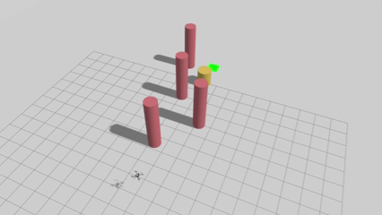

# Artificial Potential Field Obstacle Avoidance

> 3D APF (Artificial Potential Field) obstacle avoidance: a multirotor in PX4
> SITL + Gazebo simulation, sensing obstacles with a depth camera (OakD-Lite
> on x500_depth), computing the combined attractive/repulsive force in real
> time to fly toward the goal.
## Demo

### After — near-obstacle oscillation fixed


### Before — for reference


The demo has been accelerated, and there are still some minor fluctuations when
UAV is near the obstacle.


Rviz version

## Requirements

- WSL2 + Ubuntu 22.04 (or native), ROS 2 Humble
- PX4-Autopilot v1.14.4 + Gazebo Garden (the `x500_depth` model and `4002`
  airframe are built in)
- `ros_gz` bridge (must match the Gazebo version)
- Micro-XRCE-DDS-Agent, `px4_msgs`, `tmux`, Python 3.10 + `numpy`
- Needs network access once on first launch: Gazebo downloads the OakD-Lite
  model from Fuel (cached afterward)
- check [HOLO-DWA installation](https://github.com/blar-tw/HOLO-DWA/blob/main/docs/installation.md) for a detailed installation.

## Quick Start

**Before running for the first time** (once per airframe): `gz_x500_depth`
(airframe 4002) defaults to disallowing Offboard without RC and will
failsafe immediately. After launch, in PX4's `pxh>` console set:

```
param set NAV_DLL_ACT 0
param set COM_RCL_EXCEPT 4
param save
```

```bash
cd ~/ws
colcon build --packages-select apf_oa --symlink-install
cd src/APF
./run.sh                      # goal (12, 0), altitude 2 m, fixed obstacle list, opens RViz if a display is present
./run.sh 8.0 -3.0             # custom goal_x goal_y (Gazebo world coordinates)
./run.sh 8.0 -3.0 2.5         # plus custom goal altitude
OBST_SOURCE=depth ./run.sh    # switch obstacle source to the depth-camera point cloud
HEADLESS=1 ./run.sh           # no GUI (more stable tracking under WSL2)
./run.sh kill                 # tear everything down
```

After a run, inspect the results:

```bash
python3 APF_OA/tools/check_log.py     # summary of the latest flight CSV
```

## How It Works

```
Gazebo (x500_depth, world: apf_test)
   └─ OakD-Lite depth camera ──► /depth_camera/points (gz)
        ▼ ros_gz_bridge (→ /depth_points)
 obstacle_sensor_node ──► /apf/obstacle_points (PointCloud2, NED)
        │   source=fixed:  sampled points on world_spec cylinder surfaces
        │                  (omniscient, for verification)
        │   source=depth:  depth point cloud → FLU→FRD→NED conversion +
        │                  ground filtering / downsampling
        ▼
 apf_planner_node (20 Hz)
        │   INIT → TAKEOFF → NAVIGATE → GOAL_REACHED
        │   NAVIGATE: apf_core.apf_step() → 3D velocity command
        ▼
 /fmu/in/trajectory_setpoint ──► XRCE-DDS Agent ──► PX4 SITL
```

APF core ([apf_core.py](APF_OA/apf_oa/apf_core.py), pure numpy, no ROS):

- **Attractive force**: `F_att = k_att · (goal − pos)`, saturating beyond
  `att_saturation` (constant-speed pull at long range).
- **Repulsive force** (Khatib): within `influence_radius` of an obstacle
  point, `F = k_rep·(1/d − 1/d0)/d²` pushes away from it; **sector
  reduction** (12 azimuth × 3 elevation bins, nearest point per sector) is
  applied first, then summed — this decouples repulsion magnitude from
  point-cloud density, so fixed / depth sources behave consistently (without
  this step, a dense point cloud's total repulsion overwhelms the attraction
  and the drone stalls mid-flight).
- **Tangential ("swirl") force** (`tangential_gain`): a horizontal component
  perpendicular to the net repulsion, biased toward the goal side. A purely
  radial push points straight back when an obstacle sits between drone and
  goal, so it cancels the attraction and the drone bounces in place; rotating
  part of that push 90° turns the bounce into a smooth go-around and lets the
  drone slip out of the symmetric-obstacle local minimum. Kept horizontal, so
  the vertical fly-over behaviour is untouched.
- **Combined force → velocity**: the combined force is treated as the
  desired velocity, magnitude clamped to `v_max`, then **acceleration-limited**
  (`max_accel`) against the previous command before all 3 axes (vx, vy, vz)
  are sent to PX4 (per-axis NaN passthrough). The slew limit is a temporal
  low-pass over the steep near-obstacle field — the single biggest reason the
  drone no longer chatters — and doubles as a realistic soft-start/soft-turn
  for the flight controller.
- **Local-minima detection**: while still far from the goal, either
  "velocity stays near zero for consecutive ticks" **or** "displacement is
  minimal over a time window (oscillation)" flags the drone as stuck (logged
  to both the console and the CSV). The swirl force now carries the drone
  through the classic head-on trap on its own (`sim_offline.py --trap`, which
  the original algorithm could not escape, now reaches the goal), so the
  detector serves mainly as a safety monitor rather than the only line of
  defence.

Obstacle heights are deliberately designed: 4 tall cylinders at 3.5 m (block
the 2 m cruise altitude → force a horizontal detour) + 1 short cylinder at
1.2 m blocking the path directly (z-axis repulsion → flown straight over),
demonstrating both behaviors of 3D APF in a single run.

## Stability near obstacles

A plain APF drives velocity straight from the instantaneous force field, so
next to an obstacle — where the `1/d²` repulsion is steep and the nearest
sampled point keeps changing — the command swings between push and pull every
tick and the drone oscillates. Four changes fix this:

1. **Acceleration (slew-rate) limiting** on the command (`max_accel`) — a
   temporal low-pass that stops the tick-to-tick swings.
2. **Tangential swirl force** (`tangential_gain`) — converts the head-on push
   into a smooth go-around and breaks the symmetric-obstacle deadlock.
3. **Swirl taper** (`swirl_safe_radius`) — turns the swirl off very close to a
   surface so the radial push takes over and the drone is pushed clear instead
   of orbiting the obstacle (this is what preserves clearance).
4. **Earlier, stronger avoidance** (`influence_radius` 2.5→3.0, `k_rep`
   1.2→1.8) — the drone starts veering sooner, buying back the clearance that
   the smoothing lag would otherwise cost.

All are configurable in [`apf_params.yaml`](APF_OA/config/apf_params.yaml)
(set `tangential_gain: 0.0` and `max_accel: .inf` to recover the original
behaviour).

**Verified in headless Gazebo** (fixed obstacle source, identical start/goal
`(12, 0, 2)`), original algorithm → improved:

| metric (fixed-mode flight) | original | improved |
|---|---|---|
| goal reached | ✅ | ✅ |
| **min obstacle clearance** | 0.51 m | **0.73 m** |
| command variation near obstacles (jerk proxy) | 9.0 | **3.0** |
| vertical command flips near obstacles | 3 | **0** |
| ticks spent within 1 m of an obstacle | 44 | **23** |

Near an obstacle — where the fluctuation was visible — the command jerk drops
~65 %, the up/down bounce disappears, and the drone both keeps more clearance
and spends only half as long in the danger zone. The classic head-on local
minimum also no longer deadlocks:

```bash
python3 APF_OA/tools/sim_offline.py --trap   # original: stuck ~120 s → now: reaches in 9.4 s
```

One caveat if you re-tune these gains yourself: a perfect-tracking offline sim
flatters the smoothing. An earlier iteration of this fix looked excellent
offline but grazed an obstacle at 0.09 m in Gazebo, because the swirl kept the
drone orbiting the surface while PX4's velocity-tracking lag (~0.35 s) carried
it inward. The swirl taper and the earlier-avoidance retune are what fixed
that — always confirm a gain change in Gazebo, not just offline.

## Files

| Path | Role | How to test |
|------|------|---------|
| [`APF_OA/apf_oa/apf_core.py`](APF_OA/apf_oa/apf_core.py) | APF algorithm core (attraction / repulsion / swirl / accel-limited velocity / stuck detection), pure numpy | `python3 -m pytest test/` (33 tests) |
| [`APF_OA/apf_oa/world_spec.py`](APF_OA/apf_oa/world_spec.py) | Single source of truth for obstacle specs (shared by SDF, fixed list, and RViz markers) | After editing, run `tools/gen_world.py` to regenerate |
| [`APF_OA/apf_oa/obstacle_sensor_node.py`](APF_OA/apf_oa/obstacle_sensor_node.py) | Obstacle source node: fixed (known list) / depth (camera point cloud → NED) | `ros2 topic echo /apf/obstacle_points --field width` |
| [`APF_OA/apf_oa/apf_planner_node.py`](APF_OA/apf_oa/apf_planner_node.py) | Flight node: offboard state machine + APF navigation + CSV logging + RViz visualization | Run `./run.sh` and watch the 1 Hz status line; `tools/check_log.py` to inspect the CSV |
| [`APF_OA/apf_oa/pc2_util.py`](APF_OA/apf_oa/pc2_util.py) | Lightweight PointCloud2 ↔ numpy conversion | Covered by the integration tests |
| [`APF_OA/config/apf_params.yaml`](APF_OA/config/apf_params.yaml) | All parameters: k_att / k_rep / influence_radius / goal / stuck detection, etc. | Edit, then `./run.sh kill` and `./run.sh` again (symlink-install, no rebuild needed) |
| [`APF_OA/launch/apf_nodes.launch.py`](APF_OA/launch/apf_nodes.launch.py) | ROS-side launch for the three components (sensor + planner + RViz) | `ros2 launch apf_oa apf_nodes.launch.py rviz:=false` |
| [`APF_OA/worlds/apf_test.sdf`](APF_OA/worlds/apf_test.sdf) | Generated Gazebo world (5 cylinders + goal marker) | Verified with `gz sdf -k`; run.sh syncs it into PX4 automatically on every run |
| [`APF_OA/tools/gen_world.py`](APF_OA/tools/gen_world.py) | Generates the SDF above from world_spec | `python3 tools/gen_world.py` |
| [`APF_OA/tools/sim_offline.py`](APF_OA/tools/sim_offline.py) | Offline dynamics simulation (no ROS/Gazebo needed, runs in seconds); run this before tuning | `python3 tools/sim_offline.py [--trap]` |
| [`APF_OA/tools/check_log.py`](APF_OA/tools/check_log.py) | Flight CSV summary (goal reached / clearance / stuck count) | `python3 tools/check_log.py` |
| [`run.sh`](run.sh) | One-shot tmux launch of the full stack (PX4+gz / agent / bridge / nodes) | `./run.sh`, tear down with `./run.sh kill` |

CSV columns: `t, state, position (n,e,d), velocity, F_att, F_rep, F_total,
v_cmd, dist_goal, num obstacle points, stuck, stuck_episodes` →
`logs/apf_*.csv`.

## Tuning

Edit [`config/apf_params.yaml`](APF_OA/config/apf_params.yaml) and re-run
`./run.sh` (no rebuild needed). Suggested tuning order: sweep offline with
`tools/sim_offline.py --k-rep X --influence Y` first, and only move to
Gazebo once the behavior looks right.

## WIP

changing different world.sdf and a changable goal in simulation.